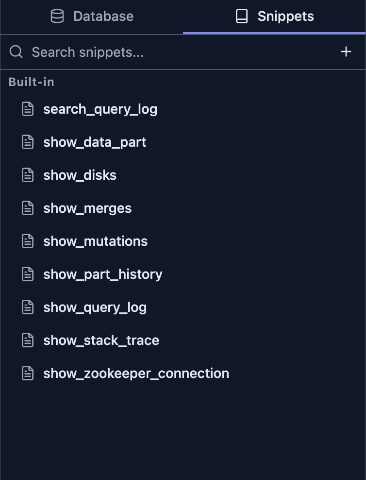
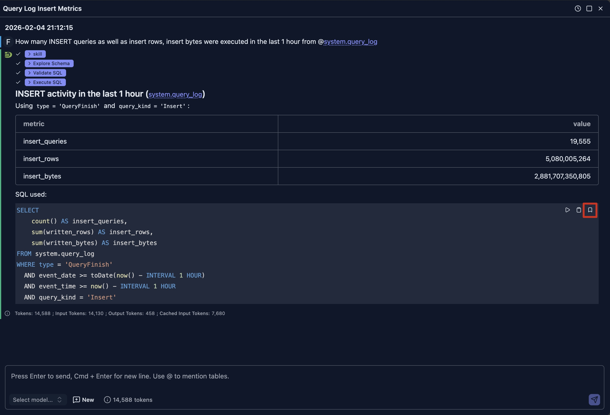

# SQL Snippets

DataStoria's SQL Snippets feature allows you to save, organize, and reuse frequently used SQL queries. Whether you're working with common query patterns, complex analytical queries, or standard operations, snippets help you work faster and more consistently.

## Overview

SQL Snippets provide:

- **Built-in Snippets**: Pre-configured templates for common ClickHouse operations
- **Custom Snippets**: Create and save your own reusable queries
- **Quick Access**: Instant insertion via autocomplete or sidebar
- **Snippet Management**: Edit, clone, and organize your snippet library
- **Auto-completion Integration**: Snippets appear in the SQL editor's autocomplete suggestions

## Accessing Snippets

### Sidebar Panel

Snippets are accessible from the left sidebar panel:

1. **Open Snippets Panel**: Click the snippets icon in the left sidebar
2. **Browse Snippets**: View all available snippets organized alphabetically
3. **Search Snippets**: Use the search box to filter snippets by name
4. **Hover for Preview**: Hover over any snippet to see its full SQL code

### Autocomplete

Snippets are integrated into the SQL editor's autocomplete:

1. **Start Typing**: Begin typing a snippet name in the editor
2. **View Suggestions**: Snippets appear in the autocomplete dropdown with a "snippet" label
3. **Select and Insert**: Choose a snippet to insert it at your cursor position

## Using Snippets

### Insert Snippet at Cursor

To insert a snippet at your current cursor position:

1. **Hover over Snippet**: In the snippets panel, hover over the snippet you want to use
2. **Click Insert Button**: Click the arrow (→) button in the snippet preview card
3. **Edit as Needed**: The snippet is inserted at your cursor position, ready for customization

### Run Snippet in New Tab

To execute a snippet immediately in a new query tab:

1. **Hover over Snippet**: In the snippets panel, hover over the snippet you want to run
2. **Click Run Button**: Click the play (▶) button in the snippet preview card
3. **View Results**: A new query tab opens with the snippet and executes it automatically

## Built-in Snippets

DataStoria includes several built-in snippets for common ClickHouse operations. 

> **NOTE**:
> Bulit-in snippets are NOT allowed to delete/modify.

### Query Analysis

- **search_query_log**: Search and filter queries from system.query_log with customizable filters for databases, tables, query types, and execution status
- **find_slow_queries**: Analyze query performance by identifying slow queries grouped by normalized query hash, showing execution time, memory usage, and frequency

### System Diagnostics

- **show_stack_trace**: Display demangled stack traces from system.stack_trace for debugging and performance analysis
- **show_disks**: View disk usage across all cluster nodes, showing free space, total space, and utilization ratios

### Data Management

- **show_data_part**: List active data parts from system.parts with optional filtering by database and table
- **show_part_history**: View data part operations history from system.part_log, including merge operations, duration, and size information
- **show_merges**: Monitor ongoing merge operations with progress, memory usage, and performance metrics
- **show_running_mutations**: Track active table mutations with their status, commands, and any failure information

### Cluster Operations

- **show_zookeeper_connection**: Display ZooKeeper connection status across all cluster nodes

## Creating Custom Snippets

### From the Snippets Panel

1. **Open Snippets Panel**: Click the snippets icon in the left sidebar
2. **Click Add Button**: Click the "+" button at the top of the snippets panel
3. **Enter Details**:
   - **Name**: Give your snippet a descriptive name (e.g., "daily_active_users")
   - **SQL**: Enter the SQL query you want to save
4. **Save**: Click "Save" to add the snippet to your library

### From the Query Editor Control Bar

In the control bar, there's a 'Save' button that allows you to save the selected text in the query editor or the whole text in the editor (if no text is selected).

### From AI-Generated SQL

You can also save SQL queries generated by the AI assistant in the chat view by clicking the bookmark icon on a SQL code block, as shown below.

Then fill in the name of the snippet and click 'Save'.

### Best Practices for Snippet Names

- **Use Descriptive Names**: Choose names that clearly describe the snippet's purpose
- **Use Underscores**: Separate words with underscores (e.g., `user_activity_report`)
- **Avoid Special Characters**: Stick to alphanumeric characters and underscores
- **Keep It Concise**: Short names are easier to type and remember
- **Use Prefixes**: Group related snippets with common prefixes (e.g., `report_`, `admin_`)

## Managing Snippets

### Editing Snippets

To modify an existing custom snippet:

1. **Hover over Snippet**: In the snippets panel, hover over the snippet you want to edit
2. **Click Edit Button**: Click the pencil (✏) button in the snippet preview card
3. **Modify Details**: Update the name and/or SQL query
4. **Save Changes**: Click the checkmark (✓) button to save your changes

> **Note**: Built-in snippets cannot be edited directly. Use the clone feature to create an editable copy.

### Cloning Snippets

To create a copy of a snippet (useful for built-in snippets or creating variations):

1. **Hover over Snippet**: In the snippets panel, hover over the snippet you want to clone
2. **Click Clone Button**: Click the copy button in the snippet preview card
3. **Edit the Copy**: The cloned snippet opens in edit mode with "\_copy" appended to the name
4. **Customize**: Modify the name and SQL as needed
5. **Save**: Click the checkmark (✓) button to save the new snippet

### Deleting Snippets

To remove a custom snippet:

1. **Hover over Snippet**: In the snippets panel, hover over the snippet you want to delete
2. **Click Delete Button**: Click the trash (🗑) button in the snippet preview card
3. **Confirm Deletion**: Click "Delete" in the confirmation dialog

> **Warning**: Deleting a snippet is permanent and cannot be undone. Built-in snippets cannot be deleted.

## Snippet Autocomplete

Snippets are automatically integrated into the SQL editor's autocomplete system:

### Triggering Snippet Suggestions

- **Automatic**: As you type, matching snippets appear in the autocomplete dropdown
- **Manual**: Press `Alt + Space` (Windows/Linux) or `Option + Space` (Mac) to show all suggestions
- **Filtering**: Continue typing to narrow down the suggestions

### Identifying Snippets

In the autocomplete dropdown, snippets are marked with:

- **Label**: "snippet" tag next to the suggestion
- **Icon**: Distinctive icon to differentiate from other suggestions
- **Preview**: Hover over a suggestion to see the full SQL code

### Inserting from Autocomplete

1. **Select Snippet**: Use arrow keys to navigate to the desired snippet
2. **Insert**: Press `Tab` or `Enter` to insert the snippet at your cursor
3. **Edit**: Customize the inserted SQL as needed

## Limitations

- **No Folders**: Snippets cannot be organized into folders (use naming prefixes instead)
- **No Sharing**: Snippets cannot be shared directly with other users
- **No Import/Export**: Bulk import/export of snippets is not currently supported
- **Browser-Specific**: Snippets are stored per browser and not synchronized

## Use Cases

### Development Teams

- **Standard Queries**: Share common query patterns across the team
- **Best Practices**: Encode team conventions into reusable snippets
- **Onboarding**: Help new team members with pre-built query templates

### Data Analysts

- **Report Templates**: Save frequently used report queries
- **Data Exploration**: Quick access to common exploratory queries
- **Performance Monitoring**: Standard queries for system health checks

### Database Administrators

- **Maintenance Tasks**: Common administrative operations
- **Health Checks**: System monitoring and diagnostics
- **Troubleshooting**: Pre-built queries for common issues

## Next Steps

- **[SQL Editor](./sql-editor.md)** — Learn about the SQL editor features and capabilities
- **[Query Execution](./query-execution.md)** — Understand how to execute queries and view results
- **[Error Diagnostics](./error-diagnostics.md)** — Get help with query errors and debugging
