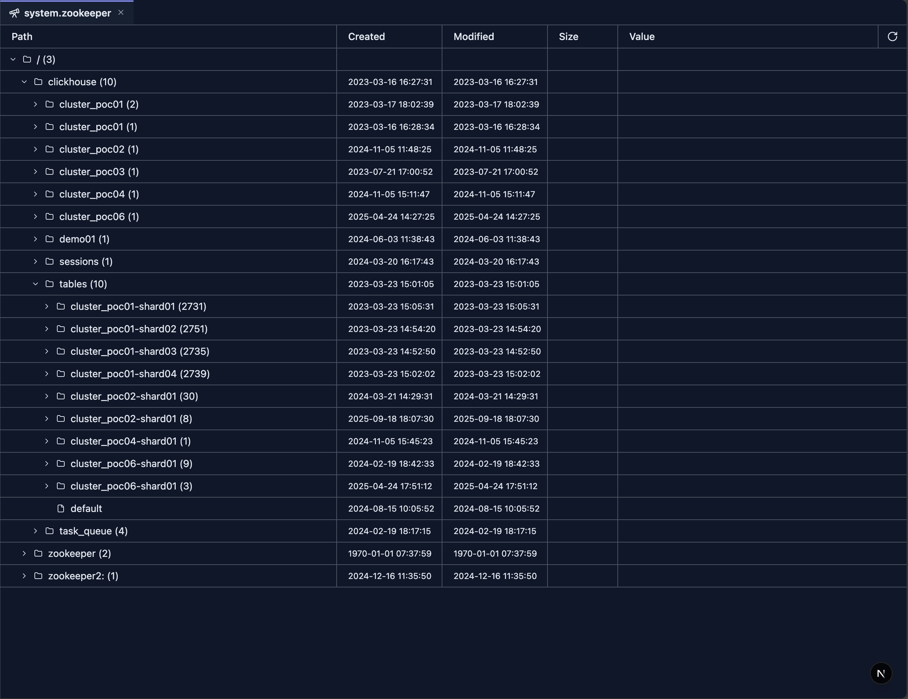

# system.zookeeper Introspection

The ZooKeeper Introspection tool provides a tree-table interface to browse and inspect ZooKeeper data used by your ClickHouse cluster. It lets you explore the hierarchical structure of znodes, view node values, and inspect metadata such as creation time, modification time, and child counts—all without writing SQL queries against the `system.zookeeper` table.

## Prerequisites

> **Note**: 
>
> 1. ZooKeeper must be configured for your ClickHouse cluster.
> 2. Read access to the `system.zookeeper` table is required to use this introspection tool. Ensure your user has the necessary system table privileges. 

## UI

The ZooKeeper Introspection tool displays a tree-table with the following columns:

- **Path** — Hierarchical tree of znodes. Expand nodes to load and view their children. Nodes with children show a count (e.g., `clickhouse (5)`).
- **Created** — Creation timestamp of the znode.
- **Modified** — Last modification timestamp of the znode.
- **Size** — Data length of the znode (hidden when zero).
- **Value** — Node value with truncation; click to view full content in a dialog.

A refresh button in the header reloads data from the root path. The Path column is resizable by dragging its right edge.

## Features

### Tree Navigation

- **Lazy Loading**: Children are fetched when you expand a node, reducing initial load time.
- **Expandable Nodes**: Nodes with children (`numChildren > 0`) show an expand icon; leaf nodes do not.
- **Child Count**: Nodes with children display the count after the name (e.g., `/ (3)`).
- **Virtual Scrolling**: Large trees are rendered efficiently with virtualization.

### Column Details

- **Path**: Displays the node name with indentation for hierarchy. Folder icon for nodes with children, file icon for leaf nodes.
- **Created / Modified**: Timestamps from ZooKeeper metadata.
- **Size**: Data length; shown only when non-zero.
- **Value**: Truncated text with click-to-expand for full content. Uses the truncatedText formatter for long values.

### Refresh

- Click the refresh icon in the header to reload the tree from the root path. All expanded state is reset.

## Use Cases

### Cluster Coordination Inspection

1. **Explore Replication Metadata**: Navigate paths like `/clickhouse` to inspect replication configuration.
2. **Verify Znode Structure**: Confirm expected znodes exist and have correct hierarchy.
3. **Check Coordination State**: Inspect leader election, locks, and coordination data.

### Troubleshooting

1. **Inspect Node Values**: Click truncated values to view full content in a dialog.
2. **Verify Timestamps**: Use Created/Modified columns to detect stale or recently changed znodes.
3. **Identify Empty Nodes**: Size column (when shown) helps distinguish data-bearing nodes from structural ones.

### Replication Monitoring

1. **Browse Replica Paths**: Navigate replication-related znodes under `/clickhouse`.
2. **Check Child Counts**: Use the displayed child count to quickly assess structure size.
3. **Refresh After Changes**: Use the refresh button after cluster or config changes to see updated state.

## Next Steps

- **[System Log Introspection](./system-log-introspection.md)** — Overview of all system log tools
- **[system.query_log Introspection](./system-query-log.md)** — Analyze query execution logs
- **[system.part_log Introspection](./system-part-log.md)** — Monitor part-level operations
- **[system.ddl_distribution_queue Introspection](./system-ddl-distributed-queue.md)** — Monitor distributed DDL operations
- **[system.query_views_log Introspection](./system-query-views-log.md)** — Monitor query view executions
